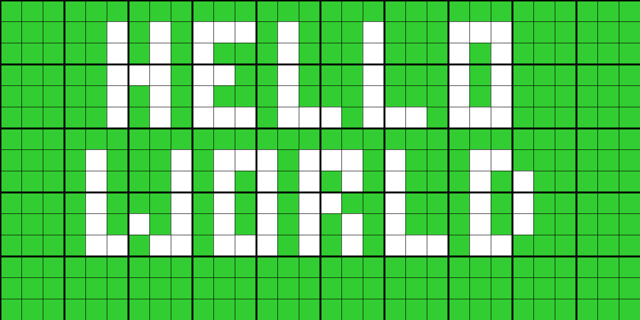
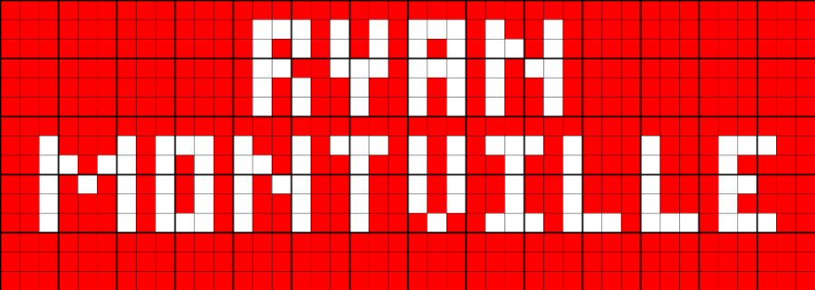

# Rubiks Text Generation
I like Rubik's Cubes. My average time to solve a 3X3 is about a minute. I wanted to explore creating Rubik's Cube mosaics, so I purchased 100 "Magic Cubes" for 12 cents each. Whenever I want to add text to a mosaic, I stuggle to get the letters and spacing correct, so I created this program to help me generate the text.

The program runs on Python and uses the Pillow library to generate an image guide of the text in the mosaic. The program is customizable to adapt to any size mosaic you want. It starts by asking how many cubes and the configuration of the cubes in the mosaic. Then it will ask what the background color of the mosaic will be, then the text color. After the user inputs the text, it generates the text, centering it in the mosaic.

The program starts by asking the user for the text to be inserted into the mosaic. It takes that text and caculates the minimum number of cubes needed to spell out the text and formats the text on one or multiple lines, centering the text. Next, the user is asked to input the desired dimensions of the mosaic, the background color of the mosiac, the text color of the mosaic, and the file name for the image that will be saved once the program has finished. The program will take the user's dimensions and determine how many words can fit on each line and the spacing required to center the text. It then creates an array of each Rubik's cube piece's color in the mosaic. After that, the program uses the pillow libray to generate the image and add guidelines to make it easy to see what patterns needs to be on each of the cubes. Final, the image is saved in the programs folder, which can be imported into Photoshop or some other program to further develop the mosaic.

[View the app](https://ryanmontville.com/rubiksTextGeneration/)

## An example of all the letters, numbers, and special characters

    
    

## Example combinations of colors
Here is are some examples of how different colored text will look with different colored backgrounds. (Your Rubik's cube's colors might look different than the images below.)

    
    
    
    
    
    

## Examples of images generated with the program

    
    

